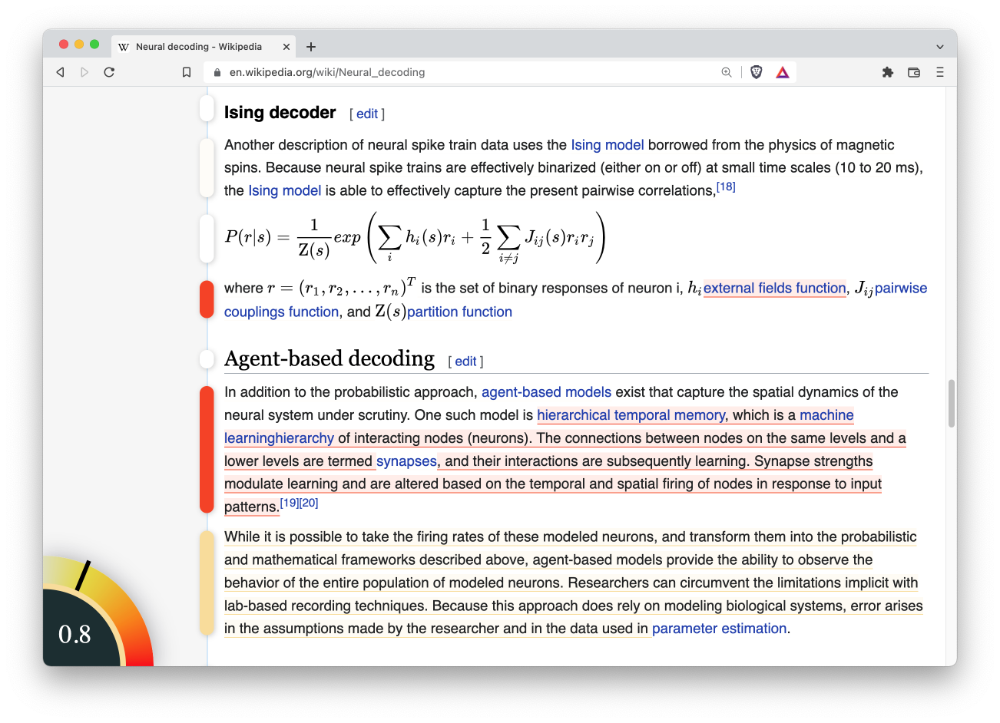

# WikiTrust 2.0
Greetings! You have found version 2 the WikiTrust system and cross-browser Extension.
The goal of WikiTrust is to compute a trust metric for the text of Wikipedia articles solely based on revison history and accumulated user reputation.



To learn more about the concept please see our [2.0 Website](https://sites.google.com/view/wikitrust2), [1.0 Website](http://www.wikitrust.net/), and papers published on the WikiTrust [algorithim](/docs/Papers.md)

__As of now, this code is a working MVP:__
- It can be run locally with a sqlite db, or connected to Google Cloud Services MySQL Instance and Cloud Storage.
- It is able to fully compute the accuracy of words within Wikipedia pages based on revision history and author experience.
- Has a functional cross-browser extension, bookmarklet and visualization tool.

__Future Directions__:

This won't happen without a passionate group of developers, if you are interested in taking this project beyond an MVP, please reach out to us by making an issue on Github!
- Making this MVP into a scalable solution for processing the whole of Wikipedia.
- Verifying that the algorithims can support eventual consistancy when processing subsets of the Wikipedia courpus and unseen revisions.
- Deploying a public server to host WikiTrust 2.0


### Installing and running the python server locally:
1. run `pip3 install -r requirements.txt` (you might use pip instead of pip3)
2. run `python3 -m main` to start the processing server (you might use python instead of python3)
3. Make sure you follow the instructions in [PRIVATE.md](./PRIVATE.md) if you want to be able to read/write to our google cloud instance as well as setting \_\___enable_gcs__\_\_ in the consts.py file.

### Installing and running the extension or bookmarklet:
- See the readme at [wikitrust_ui/extension/README.md](./wikitrust_ui/extension/README.md)

### Wikitrust File Structure
- `docs`: Contains all documentation related to the project.
- `wikitrust`: Contains all Python packages related to computation and storage.
    - `computation_engine`: Contains all Python source related to calculation of trust and reputation.
    - `database_engine`: Contains schema and controller for Wikitrust database.
    - `storage_engine`: Contains Python source related to storage of Wikipedia text.
    - `test`: Contains tests that test the `wikitrust` package.
- `wikitrust_ui`: Contains all source code related to visualization of Wikitrust data.
-`README.md`: Readme containing project overview
- `test.py`: Python script running all tests for project

### Style Best Practices
- All files should have a header describing contents of file.
- All functions should have docstring describing it. (Following Epydoc structure http://epydoc.sourceforge.net/)
```
"""
Comment describing function.
@param param1: this is a first param
@param param2: this is a second param
@return: this is a description of what is returned
@raise keyError: raises an exception
"""
```
- All code should have type annotations to the extent possible.
- Limit inline comments unless necessary. (Do not add comments to self descriptive code)


### Branching Guidelines
There are only two branches that will always be present, **master** and **develop**. For  **develop** to be merged into **master**,  a pull request must be created and all code must have been reviewed by the whole team and Luca de Alfaro.  All feature branches should branch off and back into **develop**. For a feature branch to merge into **develop**, a pull request must be created and all code must be reviewed by at least two other individuals who are not working on that feature. Optionally but reccomended, when merging from any sub branches onto a feature branch, the whole team working on that feature branch should review the code being merged. In general, for any merge apart from a merge into **master**, create a pull request, add your reviewers to the pull request on GitHub and add Eric Vin as assignee.  For any merge apart from a into **master**, create a pull request, add Luca de Alfaro as reviewer and assignee. Once a branch has been merged back into another branch and no further work will be done on it. delete that branch from GitHub.

#### Branching Checklist
- Create a pull request with your changes.
- Assign your reviewers to the pull request (Luca for **Master**, two individuals on another project for **develop**, etc...).
- Assign your assignee (Eric for **develop**, Luca for **Master**)
- Before any merge to **master** update `README.md` with current version.
- Before any merge to **master**, `docs` folder should be updated with most recent documentation from Google Drive.
- After merging to **master**, tag the commit in git with the version number for ease of reference and deployment.
